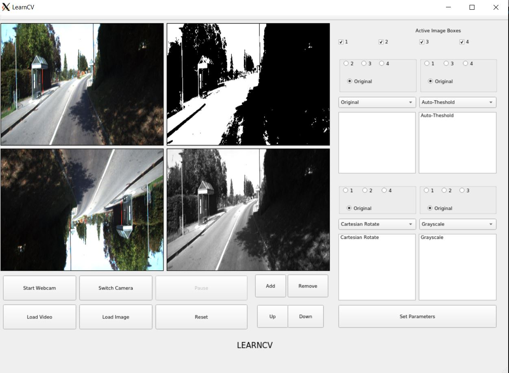

# image_processing-gui
A Qt based GUI developed for testing OpenCV functions faster and comparing results easily.


# Installation
Very Simple to Build

```
cd LearnCV
make
./LearnCV
```

Use ```make clean``` to remove build files

# System Requirements
OpenCV version 4 or higher

Qt5

# GUI Overview 


| Buttons            | Description    |
|--------------------|----------------|
|       Start Webcam |                |
|       Switch Camera|                |
|       Load Video   |                |
|       Load Image   |                |
|       Reset        |                |
|       Add          |                |
|       Remove       |                |
|       Up           |                |
|       Down         |                |

# Demo



Following operations are shown in the demo : 

1) Auto Threshold (using Otsu Thresholding)
2) RGB to Grayscale 
3) Cartesian Rotate

# License 
MIT License

